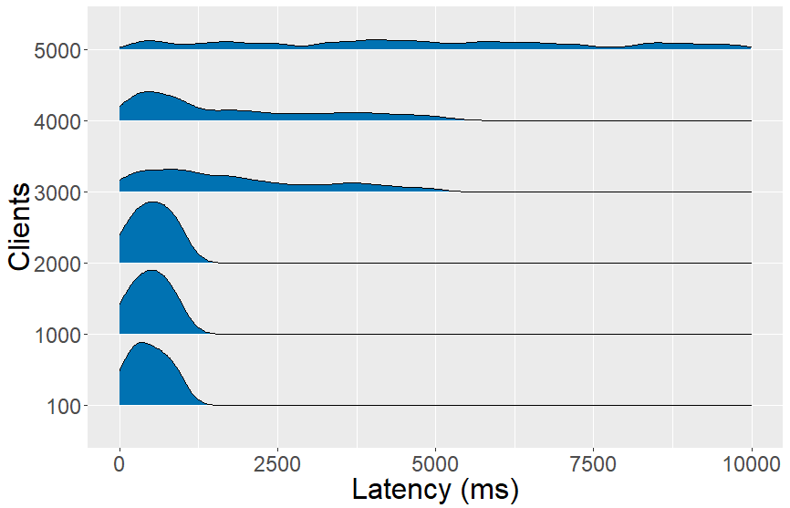
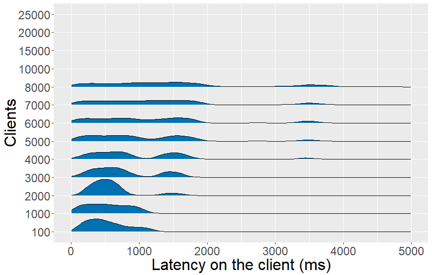
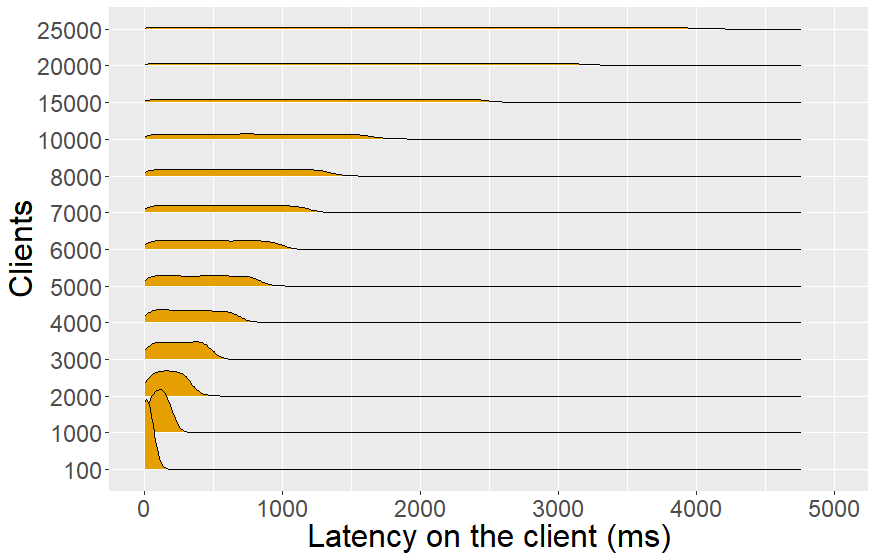
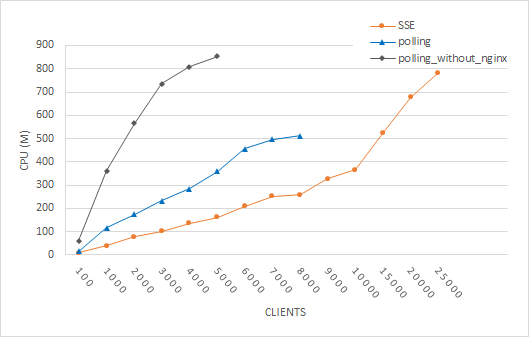

## Benchmark HTTP polling versus Server-Sent Events
{:#benchmark}

### Evaluation design

**Update interval of live dataset** The experiments focus on observing the latency on the client when a server needs to serve a high number of clients. As we want to observe the latency on the client per update and we expect a higher latency when the server works under a high load of clients, it is important to reserve enough time between updates.  shows that most datasets have an update interval in the range of seconds. By choosing a fixed update interval of 5 seconds for the live dataset in this experiment, there should be enough time to observe the latency on the client between two updates and still have a representative update interval according to . Also, an invariantly changing dataset allows to set HTTP caching headers according to the update interval, which is an opportune circumstance for HTTP polling.

**Live dataset** A JSON object with a size of 5.2 kB is generated every 5s, which has a similar size as the park+rides dataset (5.6 kB) from . This object is annotated with a timestamp that indicates when this object was generated and is used by clients to calculate the latency on the client. Furthermore, it is published inside a HTTP document for clients that use HTTP polling or it is directly pushed to clients with SSE.

**Latency on the client** The goal of this benchmark is to observe the time between the generation of an update and when a client can further process it. We define this as the latency on the client of an update. For HTTP polling, this depends on timing its request as closely as possible after a new update is available. Based on the caching headers of a response (Cache-Control for HTTP/1.1 or Expires for HTTP/1.0), a client could calculate the optimal time for its next request. In this benchmark, we choose to continuously fetch the HTTP document with a pause of 500ms between the previous response and the next request, because we expect a similar polling implementation by Open Data reusers like OpenTripPlanner.

**Web API** The live data is published with a server written in the Node.js Web application framework Express and exposes 2 API routes: /polling to retrieve a JSON document containing the latest value with an HTTP GET request and /sse to receive updates through an open TCP connection with Server-Sent-Events. The latter is naively implemented server-side with a for loop that pushes updates to every client. Multiple optimizations are possible (multi-threading, load balancing, etc.), but to make a fair comparison between HTTP polling and SSE we focus on having a single-threaded implementation for both approaches. By only using a for loop, all work needs to be done by the default Node.js single-threaded event loop. For HTTP polling, we use nginx as reverse proxy and enable single threading by configuring the number of worker_processes to 1. In order that nginx can handle many simultaneous connections with clients, the number of worker_connections is set to 10k.

**HTTP caching** Two HTTP caching components are available: one is implemented server-side using the HTTP cache of nginx, the other one at the client-side. When a client fetches the document containing the most recent update, it will first check if a non-expired copy is available in its cache (). Web browsers have this feature enabled by default, but the Node.js clients in this benchmark need to use the [cacheable-request](https://www.npmjs.com/package/cacheable-request) NPM package to support HTTP caching. An unexpected side effect of using nginx (version 1.17.7) is that it does not dynamically update the max-age value in the Cache-Control header when returning a copy from its cache. This means that a cached copy with a time-to-live of 1s will still have a max-age of 5s which leads into extra client-side caching for 5s instead of 1s. To circumvent this behaviour in our benchmark, we also added the Expires header, which indicates when the document is expired. This requires that the clocks of the server and clients are synchronized which is the case for the testbed we used. For future work, we suggest to use Varnish as reverse proxy, which dynamically updates the Cache-Control header. In , we see that the client makes a request to nginx when its cache is expired. When nginx’s cache is also expired, then  only the first request will be let through (proxy_cache_lock on) to retrieve the document from the back-end server over a persistent keep-alive connection that is configured. Other requests need to wait until nginx received the response and then pull from the updated cache. The max-age value is calculated by subtracting the time that is already passed (the current time - the time the last update is generated) from the frequency a new update is generated (5000ms). The Expires header is calculated by adding the update frequency to the time of the last update. Finally, nginx removes the Cache-Control header, which obliges the client to use the Expires header for the correct timing of its cache.

<figure id="sequencediagram-caching" style="display:flex; flex-wrap:wrap">

<figcaption markdown="block">
Two cache components (client-side and server-side/nginx) are used for HTTP polling. As Nginx does not dynamically update the max-age value from the Cache-Control header, we fall back on the Expires header for client-side caching.
</figcaption>
</figure>

**High number of clients** A benchmark environment is created using the Cloudlab testbed at the University of Utah, which had at the time of writing the biggest number (200+) among alternatives available to us of bare metal servers. This is necessary for our envisaged scenario where we need to deploy thousands of Web clients to simulate the impact on an Open Data interface. 200 HP ProLiant [m400](cite:cites m400) servers are used for our benchmark, each containing a CPU architecture with eight 64-bit ARMv8 (Atlas/A57) cores at 2.4 GHz, 64 GB of RAM, 120 TB of SATA flash storage. Notice that a m400 server uses ARM which is generally lower in performance than traditional x86 server architectures which could lead to faster detection of performance losses. Lastly, we use the Kubernetes framework to easily orchestrate the deployment and scaling of our server and clients that are containerized with Docker.

**Logging results** A time series database (InfluxDB) is deployed where clients log their latency on the client. Also, the visualisation tool Grafana is deployed to monitor whether all clients are initialized and polling or subscribed as expected and then to export the results as CSV. When an update is received on the client, only 10% is randomly logged to InfluxDB to prevent an excess of updates. We exported several minutes of recordings of the latency on the client per test, which we deem enough, for evaluation. To log the usage of the server and client (CPU and memory), we use the Kubernetes [Metrics Server](https://github.com/kubernetes-incubator/metrics-server.git). Similarly to retrieving the resource usage of a Linux machine with the ‘top’ command, we can use ‘kubectl top pods’ to extract the resource usage of Kubernetes pods. For each test, we ran this multiple times and calculated the average for plotting. The Node.js back-end and nginx reverse proxy are deployed in one single pod. This means we can easily monitor the overall resource usage for HTTP polling from both components together.

### Results

The results from our benchmark are split into two parts: first, we will show the latency on the client with density charts. Then we will look into the resource usage. We will first test HTTP polling without using nginx. This way, we demonstrate the performance boost nginx creates.

**Polling without nginx** On , we can see a group of density charts for polling without using nginx. The y-axis represents the number of clients (100, 1000, etc.) that are deployed in polling mode, while the x-axis represents the time in ms it took to retrieve a new update. For every number of clients, there is a separate density chart showing the distribution of latencies on the client that are measured. A client still uses a client-side cache and polls every 500ms, but it directly contacts the server Web API when its cache expires. For 100 clients, more than half of the updates is retrieved below 0.5s. Up to 2000 clients, the majority of updates are retrieved beneath one second. Above 2000 clients, the server struggles to respond efficiently as the latency on the client is spread from 0s up to 5s. We were unable to deploy more than 5000 clients, because the server fails to handle the number of requests.

<figure id="latency-polling-without-nginx">

<figcaption markdown="block">
Latency on the client with polling without using nginx. The server is able to answer effectively up to 2000 clients and becomes unstable above 5000 clients.
</figcaption>
</figure>

**Polling** With nginx added to the server as a reverse proxy with HTTP caching enabled, we can see on [Fig. 3.1](#latency-polling-pubsub) that the server is able to handle 8000 clients instead of 5000 clients and have a similar latency for 100 and 1000 clients as without nginx (). From 2000 clients on, a peak of the latency on the client appears between 1s and 2s. Also, a peak exists between 3s and 4s starting from 4000 clients. At 8000 clients, the distribution is evenly spread between 0s and 2s. Clients have a polling frequency of 500ms and start polling at different times, which is one of the causes of this spread. In addition, all requests wait until the cache is updated and then nginx returns responses single-threaded. To see whether this is not caused by our client implementation, we performed a benchmark with the wrk HTTP benchmarking tool, which generates a significant amount of requests to test the HTTP response latency instead of the latency on the client to retrieve an update. A wrk benchmark was performed for 30 seconds, using 12 threads, keeping 400 HTTP connections open and timeout for response times above 4s. Wrk measured a maximum response latency of 3.89s with 13 responses timed out above 4s and could reach 2.52k requests/s which acknowledges insights from the density charts on [Fig. 3.1](#latency-polling-pubsub).

<figure style="display:flex; flex-wrap:wrap" id="latency-polling-pubsub">

<figcaption markdown="block">
Latency on the client with polling (Fig. 3.1) and Server-Sent Events (Fig. 3.2). Polling scales up to 8k clients, while Server-Sent Events can serve 25k clients.
</figcaption>
</figure>

**Server-Sent Events** On [Fig. 3.2](#latency-polling-pubsub) we can see that the maximal latency on the client with a SSE interface increases with the number of clients. For 5k clients, the latency on the client is still below a second, but for 25k clients this is evenly distributed between 0s and 4s. During implementation, we faced a kernel buffer issue where data transmission is queued until no data was written from Node.js to the HTTP response objects from clients. This caused an increasing minimal latency on the client and also a higher maximal latency on the client up to 1.5s for 20k clients. A continuous data transmission was achieved by running a sleep function of 1ms per 1000 clients, because we saw on the density charts of [Fig. 3.2](#latency-polling-pubsub) that SSE could respond efficiently up to 1000 clients.

**Resource usage** We measured the CPU and memory usage for the three above-mentioned approaches. The CPU metric of a Kubernetes pod, in which our server resides, is measured in mCPUs (milliCPUs). 1000 mCPUs are equivalent to 1 AWS vCPU or 1 Hyperthread on a bare-metal Intel processor with [Hyperthreading](https://kubernetes.io/docs/tasks/configure-pod-container/assign-cpu-resource/). Memory usage is measured in mebibytes [(MiB)](https://kubernetes.io/docs/concepts/configuration/manage-compute-resources-container/#meaning-of-memory). On [Fig. 4.1](#server-cost), we can see that polling without nginx has the steepest curve for CPU and that SSE still has a significant CPU advantage over polling with nginx. We believe this is caused by SSE having less overhead than polling, although nginx is able to minimize this with connections that are kept alive, gzip compression and caching. For 5000 clients, we see that nginx decreases CPU usage by half compared to polling without nginx. The memory usage stabilizes for polling ([Fig. 4.2](#server-cost)) with preference for polling with nginx. For SSE, this continuously increases with the number of clients as every client connection is held in memory.

<figure style="display:flex; flex-wrap:wrap" id="server-cost">

<figcaption>
	CPU and memory usage of polling and Server-Sent Events.
	Left figure (Fig. 4.1), we see that SSE uses less milliCPU than polling.
	Right figure (Fig. 4.2): polling has a low memory footprint (<100 MiB), while SSE needs to keep every client connection continuously in memory.
</figcaption>
</figure>