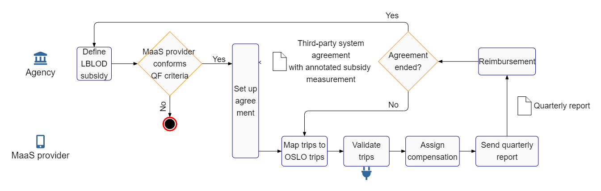

## Third-party payment specification for MaaS
{:#ttp}

The TPP specification[](cite:cites tpp) first describes the steps local governments and mobility operators can perform to compensate a travellers' trip. Inspired by projects like the Mobility Data Specifications ([MDS](cite:cites mds)) and [LBLOD](cite:cites subsidymeasurement), we specify which standards to use to describe subsidy measurements and trips, and how trips can be validated in an automated fashion. On the overview ([](#ttpdiagram)), the system starts with the local government (agency), that defines which trips can be compensated. When a MaaS provider can implement the subsidy and conforms with the cities' quality framework (QF), a TPP agreement can be arranged, which is annotated according to the Local Decisions as Linked Open Data (LBLOD)[](cite:cites buyle_iswc_demo_2016) Application Profile (AP) for subsidies [](cite:cites subsidymeasurement). The trip of a user is described with the Open Standards for Linked Organizations (OSLO) [](cite:cites buyle_egose_2016) AP 'trips and offer'[](cite:cites tripsandoffer) and can be validated with the semantically annotated agreement. When a trip meets the criteria, the validator returns how much can be compensated. For reimbursement, the mobility provider sends an invoice with the number of trip compensations.

<figure id="ttpdiagram" style="display:flex; flex-wrap:wrap">
<center>

</center>
<figcaption markdown="block">
Overview of setting up a TPP scheme between an agency (top row) and MaaS provider (bottom row).
</figcaption>
</figure>

<!-- ### Agreement

A template for an agreement is provided that agencies can use to set up a TPP system with a MaaS provider. It contains 5 articles that describe:

- the criteria that a trip must comply to for compensation
- that extra costs behold to the user
- billing happens on a quarterly basis based on an anonymized report of the compensation usage. This can of course be changed to, for example every month.
- commitment to promote the TPP system to its residents and visitors
- duration and cancellation

For the criteria, the agency needs to fill in the means of transport (e.g. bike sharing system, train etc.) that must have been used during a trip. Also, its location is implicitly indicated with the administrative boundaries of the agency that initiates the agreement. Furthermore, the agency can set a fixed number of Euros that will be repaid to the MaaS provider when a trip meets the criteria. The duration is currently set to one year and renews automatically with one year. Another possibility would be to work with a fixed start and end date. A notice to cancel the agreement must be made at least 30 days before renewal.-->

<!-- ### Agency -->

<!-- The agency can apply a qualification framework to support their decision when selecting the most appropriate MaaS provider(s). This is not part of the template, but criteria that could be part of this are:

- Integration: are all the mobility providers (shared mobility and public transport) that are active in the city integrated into the MaaS application?
- Multimodal: are at least 3 modalities supported besides public transport? 
- Service level: is there a system for handling complaints and does it support Dutch and English?
- Level of service: are subscription formulas or societal beneficial integrations such as third-party payment schemes supported? 
- Availability: is the availability of shared mobility resources displayed in real time?
- Booking: is this available for B2C and does it support pay-as-you-go?-->

<!-- A user story mapping workshop has been organised on 4th September 2019 with the partners of the  project. There it was clear that agencies want to offer compensations for at least certain means of transport, inside a certain location and for a certain time. Another important aspect is that agencies should be able to chain these criteria together so multimodal behaviour can be promoted. For example, remote municipalities can attract visitors that do not own cars by giving compensation when they take the train to the nearest station and then renting an electric bike for the last-mile travel.-->

Similarly to MDS, we provide a JSON(-LD) template with corresponding table for each type of object. 
This way, developers do not need to understand semantic technologies to start mapping their data. A JSON-LD context is added to make the template semantically interoperable. In [](#requirement), we give an example of a requirement for shared bikes in Leuven. Next to RouteSegmentRequirements, an  agency also needs to describe the SubsidyMeasurement, which combines multiple requirements, and Payment indicating how much will be compensated. More details can be found on the Github repo of the specification[](cite:cites tpp). Similarly, providers need to map every trip to "trips and offer"[](cite:cites tripsandoffer). A trip executes a certain route composing multiple route segments. These segments specify the departure and arrival time, GPS telemetry, price and transport modality. For example, [](#routesegment) demonstrates a shared bike system during rush hours and costing 8.2 Euros. With the standardized description of a trip and subsidy measurement as input, an Open Source validator is being developed[](cite:cites tpp) returning whether a trip is conform with the subsidy measurement and how much compensation can be given. MaaS providers can incorporate this tool into their route planning engine. Also, agencies could use this tool as validation step before payment.

<!-- In future work, we will provide a programmatic API and publish it on the NPM registry for easier adoption. We also are looking into wrapping this with a Web API and offer this as a Docker container. -->


<figure id="requirement" class="figure">
 ````/code/requirement.jsonld````
<figcaption markdown="block">
A traveller is eligible for a subsidy measurement when he uses a shared bicycle within the centre of Leuven and on a monday during rush hours.
</figcaption>
</figure>

<!--  ### Provider -->


<figure id="routesegment" class="figure">
 ````/code/routesegment.jsonld````
<figcaption markdown="block">
This route segment is performed during rush hours in the centre of Leuven with a shared bike system.
</figcaption>
</figure>


